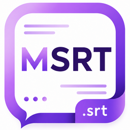

<div align="center">
  <br><br>
  <h1>MSRT — زیرنویس هوشمند</h1>
  <p><b>برنامه دسکتاپ ویندوز برای استخراج و ترجمه زیرنویس ویدیو</b></p>
  <p><i>Smart Windows desktop app for video subtitle extraction & Persian translation</i></p>
  <br>
  
  
  
  
  
</div>

---

## 🇮🇷 راهنمای فارسی

### ✨ قابلیت‌ها

| قابلیت | توضیح |
|--------|-------|
| 🎬 پردازش ویدیو | ویدیو بنداز، زیرنویس انگلیسی دقیق بگیر |
| 🌐 ترجمه فارسی | ترجمه هوشمند با Groq LLaMA 3.3 70B |
| 📄 ترجمه SRT | فایل SRT انگلیسی بده، فارسی بگیر (تایمینگ دست‌نخورده) |
| ✂️ کنترل کلمه | از ۱ تا ۱۰ کلمه در هر خط زیرنویس |
| 🔄 اعمال مجدد | بدون پردازش دوباره، تعداد کلمات رو تغییر بده |
| 📂 تاریخچه | تمام زیرنویس‌های قبلی ذخیره و قابل بازیابی |
| 🎨 تم | دارک / روشن قابل تغییر |
| 🇮🇷 🇺🇸 دوزبانه | رابط کاربری فارسی و انگلیسی |
| 📊 مصرف توکن | نمایش مصرف روزانه با ریست خودکار ۲۴ ساعته |

### 🚀 نصب و استفاده (کاربر عادی)

1. فایل `MSRT_Setup_v1.0.exe` رو از بخش [Releases](../../releases) دانلود کن
2. نصب کن و اجرا کن
3. از [console.groq.com](https://console.groq.com) یه **API Key رایگان** بگیر
4. توی تنظیمات برنامه وارد کن
5. ویدیوت رو بنداز و زیرنویس بگیر ✅

> ⚠️ **به دلیل تحریم‌ها، قبل از پردازش حتماً از فیلترشکن استفاده کن**

### 🛠️ نصب برای توسعه‌دهنده

**پیش‌نیازها:**
- Python 3.11+
- [ffmpeg](https://www.gyan.dev/ffmpeg/builds/) (اضافه شده به PATH)

```bash
git clone https://github.com/mahzoonmmd/Msrt-sub.git
cd Msrt-sub
pip install -r requirements.txt
python app.py
```

### 📦 ساخت فایل نصب

```bash
# ویرایش مسیر ffmpeg در build.bat سپس:
build.bat
# بعد از ساخت EXE، با Inno Setup فایل installer.iss رو Compile کن
```

---

## 🇺🇸 English Guide

### ✨ Features

| Feature | Description |
|---------|-------------|
| 🎬 Video Processing | Drop a video, get accurate English subtitles |
| 🌐 Persian Translation | AI-powered translation via Groq LLaMA 3.3 70B |
| 📄 SRT Translation | Input English SRT → Output Persian SRT (timings preserved) |
| ✂️ Word Control | 1–10 words per subtitle line |
| 🔄 Re-apply | Change word count without reprocessing |
| 📂 History | All past subtitles saved and reopenable |
| 🎨 Theme | Dark / Light mode |
| 🇮🇷 🇺🇸 Bilingual | Persian and English UI |
| 📊 Token Usage | Daily usage display with automatic 24h reset |

### 🚀 Installation (End User)

1. Download `MSRT_Setup_v1.0.exe` from [Releases](../../releases)
2. Install and launch
3. Get a **free API Key** from [console.groq.com](https://console.groq.com)
4. Enter it in Settings
5. Drop your video and get subtitles ✅

> ⚠️ **Due to sanctions, use a VPN before processing**

### 🛠️ Developer Setup

**Requirements:**
- Python 3.11+
- [ffmpeg](https://www.gyan.dev/ffmpeg/builds/) (added to PATH)

```bash
git clone https://github.com/mahzoonmmd/Msrt-sub.git
cd Msrt-sub
pip install -r requirements.txt
python app.py
```

---

## 🏗️ Architecture

```
Video → ffmpeg (audio extraction)
           ↓
    Groq Whisper Large v3 (speech recognition)
           ↓
    Groq LLaMA 3.3 70B (Persian translation)
           ↓
    Output: SRT + English text + Persian translation
```

## 🔑 API

| Service | Usage | Free Limit |
|---------|-------|-----------|
| [Groq](https://console.groq.com) | Speech-to-text + Translation | 14,400 sec audio/day |

## 📁 Project Structure

```
Msrt-sub/
├── app.py            # Main application
├── icon.ico          # Windows icon
├── icon_256.png      # App logo
├── requirements.txt  # Python dependencies
├── build.bat         # Build EXE script
├── installer.iss     # Inno Setup installer script
└── .gitignore
```

## 🤝 Contributing

Pull requests are welcome! For major changes, please open an issue first.

## 📄 License

[MIT](LICENSE) — Free for personal and commercial use
