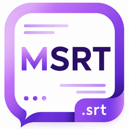

<div align="center">
  <br><br>
  <h1>MSRT — Smart Subtitles</h1>
  <p><b>Smart Windows desktop app for AI video subtitle extraction & Persian translation</b></p>
  <p><i>برنامه دسکتاپ ویندوز برای استخراج و ترجمه‌ی زیرنویس ویدیو با هوش مصنوعی</i></p>
  <br>
  
  
  
  
  
</div>

---

## 🇺🇸 English Guide

### ✨ Features

| Feature | Description |
|---------|-------------|
| 🎬 English Video Processing | Drop a video, get accurate English subtitles + Persian translation |
| 🎬 Persian Video Processing | Supports Persian-language videos too |
| 🤖 One-call transcribe + translate | Powered by Google Gemini — speech recognition and translation happen together, no separate passes |
| 🌐 Natural Persian Translation | Fluent, natural, contemporary Persian — not a literal word-for-word translation |
| 📺 Live Video Preview | 16:9 preview player with play/pause and a seek bar appears as soon as you pick a video |
| ✨ Synced Subtitle Highlighting | While the video plays, the currently-spoken line is highlighted and auto-scrolled live in both the Original and Translation views — click any line to jump straight to it |
| 🖼️ Two-column results layout | After processing: video on the left, subtitles on the right, with all actions in one row below |
| 📄 SRT Translation | Translate a ready-made SRT file (either direction), no video needed — timing preserved exactly |
| ✂️ Word Control | 1–10 words per line — controlled directly from the process page |
| 🔄 Re-apply | Change word count instantly without reprocessing or extra API calls |
| ⛔ Cancel | Stop a running job in case the wrong video/language was started by mistake |
| 📂 History | All past subtitles saved, reopenable, with per-item SRT downloads |
| 🎨 Theme | Dark / Light mode (Light by default) |
| 🇮🇷 🇺🇸 Bilingual | Persian and English UI, switchable anytime (English by default) |
| 📊 Token Usage | Daily usage meter with a manual Refresh button and automatic 24h reset |
| 👋 Onboarding | Three-step welcome guide for new users — reopen anytime from the ⓘ button |
| ℹ️ About | Project link, tech info, and support section |

### 🚀 Installation

1. Download the latest `MSRT_Setup.exe` from [Releases](../../releases)
2. Install and launch
3. Get a **free API key** from [aistudio.google.com](https://aistudio.google.com)
4. Enter it in Settings
5. Drop your video and get subtitles ✅

> ⚠️ **Google's Gemini API is not accessible from every region (export-control restrictions apply to some countries). If it doesn't connect for you, a VPN may be required.**

### ⚙️ Long Videos

MSRT extracts the audio and sends it to Google Gemini. To keep every request fast and reliable, long videos are **automatically split into ~10-minute chunks** before sending — there's no file-size limit to worry about or manually work around; this happens transparently regardless of how long the video is.

> 💡 The installer includes `ffmpeg` and `ffprobe` — no separate installation needed

### 🛠️ Developer Setup

**Requirements:** Python 3.11+ and [ffmpeg](https://www.gyan.dev/ffmpeg/builds/)

```bash
git clone https://github.com/mahzoonmmd/Msrt-sub.git
cd Msrt-sub
pip install -r requirements.txt
python app.py
```

### 📦 Building the Installer

```bash
# Put ffmpeg.exe and ffprobe.exe next to app.py, then:
build.bat
# Compile installer.iss with Inno Setup
```

### 💙 Support the Project

If MSRT has been useful, a ⭐ **Star** and **Follow** help this project grow!

[](https://github.com/mahzoonmmd/Msrt-sub/stargazers)
[](https://github.com/mahzoonmmd)

---

<div dir="rtl">

## 🇮🇷 راهنمای فارسی

### ✨ قابلیت‌ها

| قابلیت | توضیح |
|--------|-------|
| 🎬 پردازش ویدیوی انگلیسی | ویدیو بنداز، زیرنویس انگلیسی دقیق بگیر + ترجمه فارسی |
| 🎬 پردازش ویدیوی فارسی | ویدیوهای فارسی رو هم زیرنویس می‌کنه |
| 🤖 رونویسی + ترجمه در یک مرحله | با Google Gemini — تشخیص گفتار و ترجمه با هم انجام می‌شه، بدون مرحله‌ی جدا |
| 🌐 ترجمه فارسی روان | ترجمه‌ی طبیعی و محاوره‌ای، نه ترجمه‌ی کلمه‌به‌کلمه |
| 📺 پیش‌نمایش زنده‌ی ویدیو | با انتخاب ویدیو، بلافاصله یک پلیر با نسبت ۱۶:۹ همراه با دکمه‌ی پخش و نوار پیشرفت نمایش داده می‌شه |
| ✨ هایلایت هم‌زمان زیرنویس | حین پخش ویدیو، خط در حال گفته‌شدن به‌صورت زنده هم در متن اصلی و هم ترجمه هایلایت و اسکرول می‌شه — با کلیک روی هر خط می‌تونی مستقیم به همون لحظه بری |
| 🖼️ چیدمان دوستونه‌ی نتایج | بعد از پردازش: ویدیو سمت چپ، زیرنویس سمت راست، همه‌ی دکمه‌ها در یک ردیف پایینشون |
| 📄 ترجمه SRT | ترجمه‌ی یک فایل SRT آماده (هر دو جهت)، بدون نیاز به ویدیو — تایمینگ کاملاً حفظ می‌شه |
| ✂️ کنترل کلمه | از ۱ تا ۱۰ کلمه در هر خط زیرنویس — مستقیم از صفحه‌ی پردازش |
| 🔄 اعمال مجدد | بدون پردازش دوباره و بدون تماس اضافه با API، تعداد کلمات رو فوراً تغییر بده |
| ⛔ لغو | توقف پردازش در حال اجرا، برای مواقعی که ویدیو یا زبان اشتباه انتخاب شده |
| 📂 تاریخچه | تمام زیرنویس‌های قبلی ذخیره، قابل بازیابی، و با دانلود SRT مستقیم از همون‌جا |
| 🎨 تم | تیره / روشن (پیش‌فرض: روشن) |
| 🇮🇷 🇺🇸 دوزبانه | رابط کاربری فارسی و انگلیسی، هر زمان قابل‌تعویض (پیش‌فرض: انگلیسی) |
| 📊 مصرف توکن | نمایش مصرف روزانه با دکمه‌ی Refresh دستی و ریست خودکار ۲۴ ساعته |
| 👋 راهنمای اولیه | راهنمای سه‌مرحله‌ای برای کاربران جدید — با دکمه‌ی ⓘ هر زمان قابل‌بازکردن مجدد |
| ℹ️ درباره | لینک پروژه، اطلاعات فنی، و بخش حمایت |

### 🚀 نصب و استفاده

۱. آخرین نسخه‌ی `MSRT_Setup.exe` رو از بخش [Releases](../../releases) دانلود کن
۲. نصب کن و اجرا کن
۳. از [aistudio.google.com](https://aistudio.google.com) یه **API Key رایگان** بگیر
۴. توی تنظیمات برنامه وارد کن
۵. ویدیوت رو بنداز و زیرنویس بگیر ✅

> ⚠️ **API گوگل Gemini از همه‌ی مناطق در دسترس نیست (به‌خاطر محدودیت‌های صادراتی بعضی کشورها). اگه براتون وصل نشد، ممکنه نیاز به VPN داشته باشید.**

### ⚙️ ویدیوهای بلند

MSRT صدای ویدیو رو استخراج و به Google Gemini می‌فرسته. برای اینکه هر درخواست سریع و پایدار بمونه، ویدیوهای بلند **خودکار به بخش‌های حدوداً ۱۰ دقیقه‌ای تقسیم** می‌شن — دیگه نیازی به نگرانی از محدودیت حجم فایل یا کار دستی نیست؛ این کار صرف‌نظر از طول ویدیو، شفاف و خودکار انجام می‌شه.

> 💡 فایل نصبی هر دو `ffmpeg` و `ffprobe` رو داخل خودش داره — نیازی به نصب جداگانه نیست

### 🛠️ نصب برای توسعه‌دهنده

**پیش‌نیازها:** Python 3.11+ و [ffmpeg](https://www.gyan.dev/ffmpeg/builds/)

```bash
git clone https://github.com/mahzoonmmd/Msrt-sub.git
cd Msrt-sub
pip install -r requirements.txt
python app.py
```

### 📦 ساخت فایل نصب

```bash
# ffmpeg.exe و ffprobe.exe رو کنار app.py بذار، بعد:
build.bat
# با Inno Setup فایل installer.iss رو Compile کن
```

### 💙 حمایت از پروژه

اگه MSRT برات مفید بوده، با یه ⭐ **Star** و **Follow** کمک کن این پروژه رشد کنه!

[](https://github.com/mahzoonmmd/Msrt-sub/stargazers)
[](https://github.com/mahzoonmmd)

</div>

---

## 🏗️ Architecture

```
Video → ffmpeg (audio extraction)
           ↓
    [auto-split into ~10-minute chunks, regardless of length]
           ↓
    Google Gemini (gemini-3.5-flash-lite)
    — transcription + translation + timestamps, in one call per chunk
           ↓
    Output: SRT + original-language text + translated text
```

## 🔑 API

| Service | Usage | Notes |
|---------|-------|-------|
| [Google Gemini](https://aistudio.google.com) | Speech-to-text + Translation | Free tier available — check current limits at [ai.google.dev](https://ai.google.dev) |

## 📁 Project Structure

```
Msrt-sub/
├── app.py            # Main application
├── icon.ico          # Windows icon
├── icon_256.png      # App logo
├── requirements.txt  # Python dependencies
├── build.bat          # Build EXE script
├── installer.iss     # Inno Setup installer script
└── .gitignore
```

## 🤝 Contributing

Pull requests welcome! Open an issue for major changes first.

## 📄 License

[MIT](LICENSE) — Free for personal and commercial use
